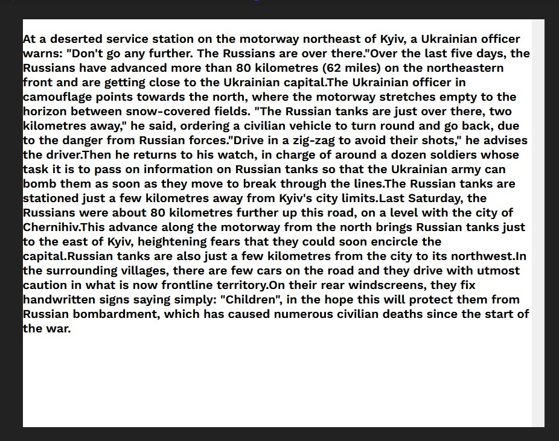
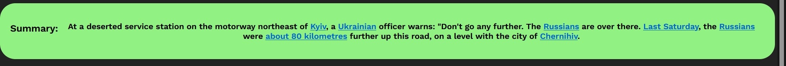
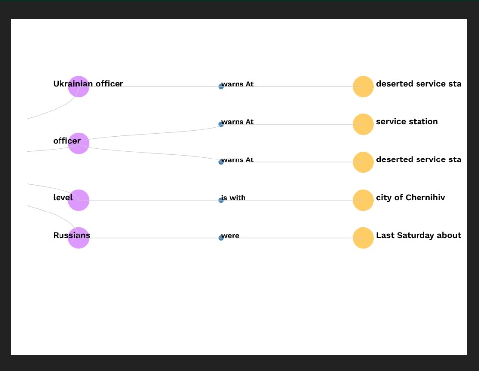

# sumviz_TSECHACKS

### Summarize your text in a way that is easy to read and understand and create a graph representation of the text.

### The tool captures as much gist of the text in the graph representation.

### Currently only avaliable as a web application (requires you to run the server.py file).

## Run using the following command:

```shell
python server.py
```

## Download the required model:
[drive](https://drive.google.com/drive/folders/1INV8aXE62ASX3LvUJB8mdjwfuwO0NOW7?usp=sharing)

### Just extract the rar file in the route directory of the repository.

## example:


